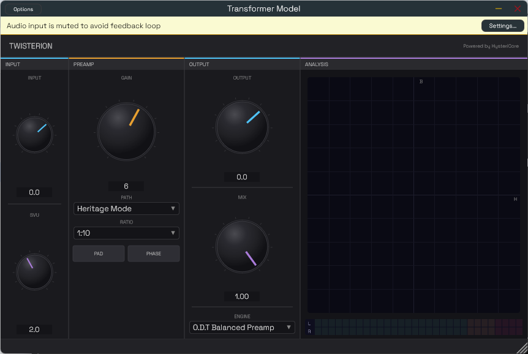

# TWISTERION

> **Powered by HysteriCore** -- Physical magnetic transformer modelling



TWISTERION is a physics-based audio plugin that models magnetic transformer saturation from first principles. No impulse responses, no static waveshapers -- real Jiles-Atherton hysteresis with Bertotti dynamic losses, an analytical LC biquad for parasitic resonance, and Antiderivative Antialiasing in the realtime path.

---

## Features

| Feature | Details |
|---|---|
| **HysteriCore engine** | Proprietary magnetic hysteresis core -- Jiles-Atherton physics + CPWL/ADAA realtime path |
| **Legacy engine** | Single-transformer mode driven by 8 factory presets (Jensen, Neve-style, voicings) |
| **Double Legacy engine** | Cascaded T1 (JT-115K-E) -> T2 (JT-11ELCF) with full impedance coupling between stages |
| **Harrison Console engine** | Mic preamp modelled on the Harrison 32-series: JT-115K-E + U20 NE5532-style gain stage with rail-aware soft-clip and slew limiting |
| **Realtime mode** | CPWL + ADAA -- no oversampling, low CPU |
| **Artistic mode** | Full implicit Jiles-Atherton solver + Bertotti excess-loss field separation + 4x (or 2x) polyphase oversampling -- offline bounce quality. *Coloring-grade scope — see [`docs/MODEL_LIMITATIONS.md`](docs/MODEL_LIMITATIONS.md).* |
| **B-H Scope** | Real-time hysteresis loop visualization (lock-free SPSC queue) |
| **Stereo TMT** | Component tolerance spread L/R for natural stereo width |
| **Identification pipeline** | CMA-ES + Levenberg-Marquardt -- fit J-A params from measured B-H curves |
| **Plugin formats** | VST3, AU, AAX, Standalone (JUCE 8) |

---

## Engines

The plugin exposes three independent engines, switchable in real time:

### Legacy (Transformer)

A single transformer in cascade. Driven by an 8-preset selector
(Jensen JT-115K-E, JT-11ELCF, Neve 10468 Input, Neve LI1166 Output, plus
voicings: Clean DI, Vocal Warmth, Bass Thickener, Master Glue).

Per-preset gain calibration via `legacyInputOffsetDb` / `legacyOutputOffsetDb`
in `TransformerConfig` (defaults `-10 dB` in / `+15 dB` out across all current
Legacy presets, future per-preset overrides via factory).

### Double Legacy (Cascade)

Two transformers in series:

```
IN -> [JT-115K-E (T1)] -> [JT-11ELCF (T2)] -> OUT
```

T2 sees as source impedance the secondary DC resistance of T1; T1 sees as load
the input impedance of T2 (`Rdc_pri_T2 + 2*pi*1kHz*Lp_pri_T2`). This produces
the medium-bass dip / resonance characteristic of cascading two transformers
without an inter-stage buffer.

Live T2 load switching: `600 Ohm` (broadcast) / `10k` (bridging, default) /
`47k` (Hi-Z).

### Harrison Console Mic Pre

JT-115K-E mic input transformer cascaded with a U20 op-amp gain stage modelled
on the NE5532 in the Harrison 32-series:

```
MIC IN -> [Z_source -> PAD -> JT-115K-E (J-A + Bertotti)] -> [U20 biquad + tanh + slew limiter] -> OUT
```

The U20 stage is a 2nd-order biquad derived analytically from KCL at the
inverting node, BLT-prewarped at the HF compensation pole (~1.59 kHz). After
the linear filter:

- `tanh` soft-clip at +/-13 V (rail saturation, NE5532 +/-15 V supply minus
  2 V margin)
- Slew-rate limit at 9 V/us (typical 5532 datasheet)

Continuous mic gain pot, switchable PAD (-20 dB), phase reverse, source
impedance (50-600 Ohm), and Bertotti dynamics mix (0 = quasi-static,
1 = full preset).

---

## Signal Flow (per engine)

The active engines all share the same per-transformer cascade:

```
x -> [Flux Integrator (1/f, Artistic mode)] -> [Bertotti H_dyn pre-J-A]
   -> [J-A solveImplicitStep(H_eff = H_applied - H_dyn)]
   -> [HP filter (R_source / Lm dynamic)]
   -> [LC parasitic biquad (analytical BLT, 2nd or 3rd order with Zobel)]
   -> wet
```

Mix/gain handled at block level by `processBlockRealtime` /
`processBlockPhysical`. Artistic mode wraps the per-sample cascade inside
a 2-stage halfband oversampler (39 samples round-trip @ OS4x, 13 @ OS2x).
The Bertotti dynamic loss is applied as an opposing field pre-J-A
(field separation, Sprint A2 Voie C) — not as a post-hoc B correction.

---

## Architecture

Three strict dependency layers -- `core/` has **zero external dependencies**.

```
Plugin (JUCE)
   +-- Transformer Model        TransformerModel<NonlinearLeaf>
   |     +-- Magnetics          HysteresisModel, JilesAthertonLeaf, CPWLLeaf,
   |     |                      DynamicLosses (Bertotti), FluxIntegrator
   |     +-- DSP                LCResonanceBiquad (BLT, up to 3rd order),
   |     |                      ADAAEngine, OversamplingEngine
   |     +-- Utilities          Constants, SmoothedValue, SPSCQueue,
   |                            SmallMatrix, AlignedBuffer, SIMDMath
   +-- Harrison Mic Pre         HarrisonMicPre, OpAmpGainStage (U20)

Identification (offline, cold path)
   +-- CMA_ES -> LevenbergMarquardt -> CPWLFitter -> IdentificationPipeline
```

### Processing Modes

**Realtime** (monitoring) -- CPWL directional hysteresis + 1st-order ADAA per
leaf. No oversampling. Low CPU footprint, suitable for live monitoring.

**Physical** (bounce/render) -- Full implicit Newton-Raphson J-A solver,
2-substep trapezoidal companion model, 4x (or 2x) polyphase oversampling.

---

## Plugin Parameters

| Parameter | Range | Default | Description |
|---|---|---|---|
| **Engine** | Double Legacy / Legacy / Harrison Console | Double Legacy | Active processing topology |
| **Mode** | Realtime / Physical OS4x / Physical OS2x | Realtime | DSP precision vs CPU tradeoff |
| **Input Gain** | -40 to +20 dB | 0 dB | Drive level into the transformer |
| **Output Gain** | -40 to +20 dB | 0 dB | Output level compensation |
| **Mix** | 0 -- 100 % | 100 % | Dry/wet parallel blend |
| **Transformer (Legacy)** | 8 factory presets | JT-115K-E | Active preset for Legacy mode |
| **T2 Load (Double Legacy)** | 600 Ohm / 10k / 47k | 10k | Output transformer secondary load |
| **SVU** | 0 -- 5 % | 2 % | Stereo Variation Units (TMT tolerance spread L/R) |
| **Mic Gain (Harrison)** | 0 -- 1 (continuous pot) | 0.5 | U20 alpha pot position |
| **PAD (Harrison)** | On / Off | Off | -20 dB input attenuation |
| **Phase (Harrison)** | Normal / Invert | Normal | Polarity inversion |
| **Source Z (Harrison)** | 50 -- 600 Ohm | 150 Ohm | Mic source impedance |
| **Dynamics (Harrison)** | 0 -- 1 | 1.0 | Bertotti K1/K2 mix (0 = quasi-static) |

---

## Key Technical Innovations

### HysteriCore -- Magnetic Hysteresis Engine

Physically models ferromagnetic hysteresis via the Jiles-Atherton equations
(5+2 parameters: Ms, a, k, alpha, c + Bertotti dynamic losses K1/K2). Two
execution paths:

- **Physical**: Implicit Newton-Raphson trapezoidal solver with 2x
  sub-stepping for sample-rate invariance + 4x polyphase oversampling
- **Realtime**: CPWL piecewise-linear approximation with analytical
  1st-order ADAA -- low aliasing, no oversampling overhead

### LCResonanceBiquad

Analytical 2nd or 3rd-order biquad modelling the LC parasitic resonance
(`Lleak`, `Cw`, `Cp_s`, optional Zobel `Rz/Cz`). Bilinear-transformed from
the loaded circuit transfer function with auto-Zobel Q clamping (Q_max = 5)
and Cp_s feedforward zero modelling for unshielded transformers.

### Bertotti Field Separation

`H_total = H_hyst + K_eddy * dB/dt + K_exc * sign(dB/dt) * |dB/dt|^0.5`. The
dynamic terms reduce the effective field driving the static J-A model,
concentrating distortion at low frequencies and providing high-frequency
transparency -- matching real transformer behavior.

### Harrison U20 Stage

Closed-form biquad for the NE5532-equivalent op-amp `H(s, alpha)` derived from
KCL at the U20 inverting node, BLT-prewarped at the HF compensation pole
(~1.59 kHz). Coefficients computed in double, state in DF2T double, I/O in
float. Followed by `tanh(y / V_clip)` rail saturation and a sample-by-sample
slew limiter.

### LangevinPade [3/3]

The anhysteretic function `L(x) = coth(x) - 1/x` approximated by
`x(15+x^2)/(45+6x^2)`. No transcendental calls on the hot path -- ~10x faster
than `std::tanh`.

---

## Repository Layout

```
Transfo_Model/
|-- core/include/core/
|   |-- util/          Constants, SmallMatrix, AlignedBuffer, SPSCQueue,
|   |                  SIMDMath, SmoothedValue
|   |-- magnetics/     HysteresisModel, JilesAthertonLeaf, CPWLLeaf,
|   |                  DynamicLosses, FluxIntegrator, AnhystereticFunctions
|   |-- dsp/           ADAAEngine, OversamplingEngine, LCResonanceBiquad
|   |-- harrison/      HarrisonMicPre, OpAmpGainStage, ComponentValues
|   +-- model/         TransformerModel, TransformerConfig, Presets,
|                      ToleranceModel, LCResonanceParams, PresetLoader,
|                      PresetSerializer, CoreGeometry, WindingConfig,
|                      TransformerGeometry
|
|-- identification/include/identification/
|   |-- CMA_ES.h                   Global optimizer (log-reparametrised)
|   |-- LevenbergMarquardt.h       Local polish optimizer
|   |-- CPWLFitter.h               Convert J-A model -> realtime CPWL leaf
|   |-- ObjectiveFunction.h        Multi-component cost (THD, coercivity, closure)
|   |-- IdentificationPipeline.h   Phase 0->3 orchestration
|   +-- ActiveLearning.h           CMA-ES ensemble -- suggest next measurement
|
|-- plugin/Source/
|   |-- PluginProcessor.h/cpp      Audio engine (3-engine stereo processing)
|   |-- PluginEditor.h/cpp         TWISTERION GUI (Space Grotesk)
|   |-- BHScopeComponent.h/cpp     Real-time B-H loop visualization
|   |-- LevelMeterComponent.h      Stereo dBu LED bargraph
|   |-- VUMeterComponent.h         VU needle meter
|   +-- ParameterLayout.h          APVTS parameter definitions
|
|-- plugin/Resources/              Embedded fonts (Space Grotesk)
|-- Tests/                         24 CTest targets covering core, plugin paths,
|                                  Harrison stage, Jensen presets, LC biquad
|-- data/                          B-H curves JSON, transformer configs
|-- tools/                         CLI simulator, demo audio generator
+-- docs/                          SRS, sprint plans, architecture decisions
```

---

## Build

**Requirements:** CMake 3.22+, C++17 compiler (MSVC 2019+ / Clang 14+ / GCC 11+).
JUCE 8.0.4 is auto-fetched via FetchContent.

```sh
# Build plugin (VST3 + AU + AAX + Standalone)
cmake -B build
cmake --build build --config Release

# Build and run core tests (no JUCE dependency)
cmake -S Tests -B build_tests
cmake --build build_tests --config Release
ctest --test-dir build_tests -C Release --output-on-failure
```

The `core/` library is **header-only** with zero external dependencies.

---

## Tests

24 CTest targets -- all green. Coverage includes:

- ADAA antiderivative continuity and alias suppression
- CPWL direction switching and passivity enforcement
- J-A stability, LangevinPade properties, dynamic losses
- LC biquad: 20 cases on Jensen presets (flat audio band, Zobel damping,
  step response Bessel alignment, Q-clamp safety, runtime parameter update,
  Faraday shield model, datasheet FR validation)
- Jensen passivity / convergence / harmonics / Bertotti frequency response /
  CPWL parity vs full J-A
- Newton-Raphson stress at low H, sample-rate invariance, flux integrator
  physical/diagnostic modes
- Harrison mic pre: gain accuracy, frequency response, integration with
  J-A + Bertotti
- Plugin lifecycle: instantiation, APVTS, mode switching, state save/load,
  channel strip, Double Legacy plugin path stress (variable block sizes,
  T2 load switching, gain sweeps)
- THD validation, frequency response validation, plugin integration

---

## References

- Jiles & Atherton, *J. Magn. Magn. Mater.* 61 (1986) -- J-A hysteresis model
- Bertotti, *IEEE Trans. Magn.* (1988) -- Dynamic loss separation
- Baghel & Kulkarni, *IEEE Trans. Magn.* (2014) -- Field separation NR
- Parker & Valimaki, *IEEE SPL* (2017) -- Antiderivative Antialiasing
- Magnetic Shields Ltd -- B-H curves for mu-metal and NiFe-50
- Jensen datasheets -- JT-115K-E and JT-11ELCF specifications
- Harrison Consoles -- 32-series mic preamp schematic (U20 NE5532 stage)
- Brainworx Patent US 10,725,727 -- TMT stereo tolerance

---

## License

Research / personal use. Contact author for commercial licensing.
